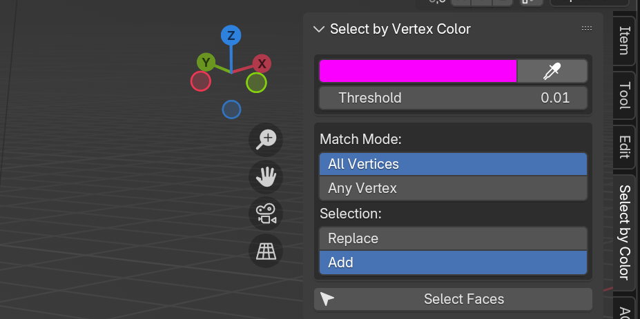

# Select by Vertex Color for Blender

Selecting hundreds of faces by hand just because they share a specific vertex color is a great way to waste an afternoon. This addon lets you do it in about five seconds.

It adds a small panel in Blender's sidebar. You pick a color from a face on your model, click a button, and all the faces with that same color get selected. It's that simple.

## Installation

1.  Download the `select_by_vertex_color_v2.py` file from this repository.
2.  In Blender, go to `Edit > Preferences > Add-ons`.
3.  Click the `Install...` button and pick the `.py` file you downloaded.
4.  Tick the checkbox next to **"Select by Vertex Color (v2)"** to enable it.
5.  The panel is now ready in the 3D Viewport.

## How to Use It

1.  Select your object and switch to **Edit Mode**.
2.  Make sure your object has a Vertex Color layer (you can check in the green triangle tab `Object Data Properties > Vertex Colors`).
3.  Press `N` to open the sidebar and find the **"Select by Vertex Color"** tab.
4.  Select **one single face** that has the color you want to work with.
5.  Click the **Eyedropper** button in the addon panel. The color swatch will update to match your selected face.
6.  Adjust the **Threshold** if you want to include colors that are *almost* a match. A tiny value is for perfectionists; a larger value is more forgiving.
7.  Click the big **"Select Faces"** button.

All matching faces are now selected. You just saved yourself a lot of clicking.

## Other Controls

*   **Match Mode:**
    *   `All Vertices`: Selects faces only when all of their corners match the color.
    *   `Any Vertex`: Selects faces if at least one corner matches.
*   **Select Mode:**
    *   `Replace`: Clears your old selection.
    *   `Add`: Adds to whatever you already have selected.
